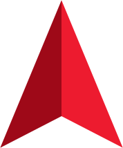

TODO:
- Add UWB ROS messages with instructions 
- UWB calibration in rosbags? Maybe provide a node to do calibration when Rosbag is playing
- Mention lack of camera images outside of rosbags
- Fit spline to mocap and have it as an attribute of MILUV to be called by the user
- Load the CIR files. Is it possible to match each to range/passive measurements?

##  DECAR &mdash; MILUV devkit
Welcome to the MILUV devkit page. This Python devkit provides useful functions and examples to accompany the MILUV dataset, which can be downloaded at (ADD LINK HERE). To begin using this devkit, clone or download and extract the repository.


## Table of Contents
- [Changelog](#changelog)
- [Devkit setup and installation](#devkit-setup-and-installation)
- [Getting started with MILUV](#getting-started-with-MILUV)
    - [Setting up the dataset](#setting-up-the-dataset)
    - [Examples](#examples)
- [Citation](#citation)
- [License](#license)

## Changelog
31-04-2024: MILUV devkit v1.0.0 released.

## Devkit setup and installation
The devkit requires Python 3.8 or greater. To install the devkit and its dependencies, run

    $ pip3 install .
inside the devkit's root directory (~/path/to/project/MILUV). 

Alternatively, run

    $ pip3 install -e .

inside the devkit's root directory, which installs the package in-place, allowing you make changes to the code without having to reinstall every time. 

For a list of all dependencies, refer to ``requirements.txt`` in the repository's root directory.

To ensure installation was completed without any errors, test the code by running
    
    $ pytest
in the root directory.

## Getting started with MILUV
### Setting up the dataset
To get started, download the MILUV dataset. By default, the devkit expects the data for each experiment is present in **/miluv/data/EXP_NUMBER**, where EXP_NUMBER is the number of the experiment outlined in PAPER.

If you wish to change the default data location, be sure to modify the data directory in the deckit code.

### Examples
Using the MILUV devkit, retrieving sensor data by timestamp from experiment ``1c`` can be implemented as:
```py
from miluv.data import DataLoader
import numpy as np

mv_1c = DataLoader(
        "1c",
        barometer=False,
        height=False,
    )

timestamps = np.arange(0E9, 10E9, 1E9)  # Time in ns

data_at_timestamps = mv_1c.data_from_timestamps(timestamps)
```

This example can be made elaborate by selecting specific robots and sensors to fetch from at the given timestamps.
```py
from miluv.data import DataLoader
import numpy as np

mv_1c = DataLoader(
        "1c",
        barometer=False,
        height=False,
    )

timestamps = np.arange(0E9, 10E9, 1E9)  # Time in ns

robots = ["ifo001", "ifo002"]  # We are leaving out ifo003
sensors = ["imu_px4", "imu_cam"]  # Fetching just the imu data

data_at_timestamps = mv_1c.data_from_timestamps(
    timestamps,
    robots,
    sensors,
    )
```

To run the extended Kalman filter benchmarking task, run
```
@ shabbir Fill this out please
```

## Known issues
If you encounter any issues, please email mohammed.shalaby@mail.mcgill.ca. All unresolved issues are recorded here.

- No known issues as of release

## Citation
TBD

## License
This project is distributed under the MIT License.